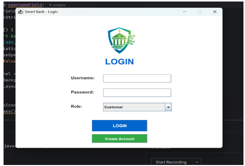
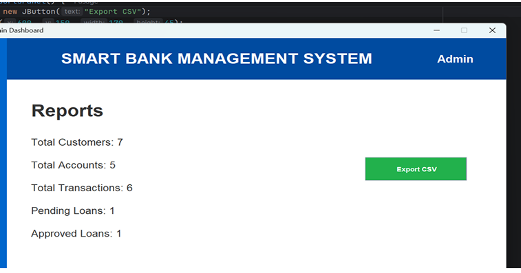
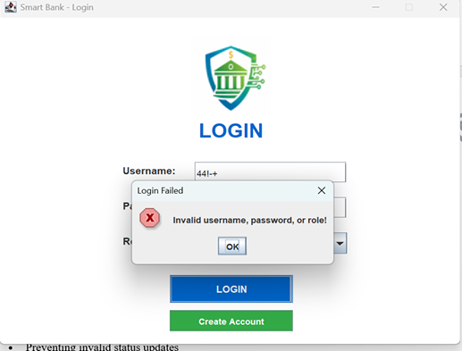
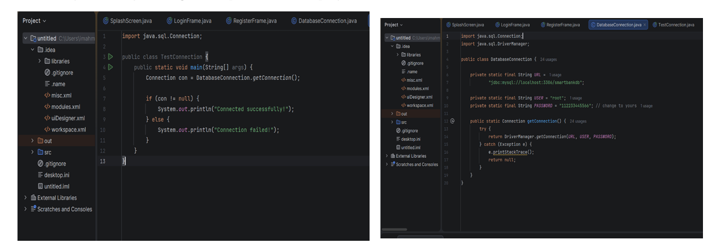

# Smart Bank Management System 🏦

A Java-based banking management system developed using Java Swing and MySQL.

## 📌 About the Project

Smart Bank is a desktop banking application that provides banking services for both customers and administrators.

## ✨ Features

- 🔐 User Login & Registration
- 💳 Account Management
- 💰 Deposit & Withdrawal
- 🔄 Fund Transfer
- 🏦 Loan Requests
- 📊 Reports & Statistics
- 👨‍💼 Admin Dashboard
- 🔔 Notifications
- 📄 CSV Report Export
- ⚠️ Input Validation & Error Handling

## 🛠️ Technologies & Tools

- Java
- Java Swing
- MySQL
- JDBC
- SQL
- NetBeans
- MySQL Workbench
- CSV
- Object-Oriented Programming (OOP)

## 🖥️ Screenshots

### Login

### Customer Dashboard

### Admin Dashboard

### Reports & CSV Export

### Error Handling

### Database Connection

-------------------------------------------------------------------------------------------------------------
> 📚 This project was developed as a university course project for CSC236: Object Oriented Programming (2).
> -----------------------------------------------------------------------------------------------------------
